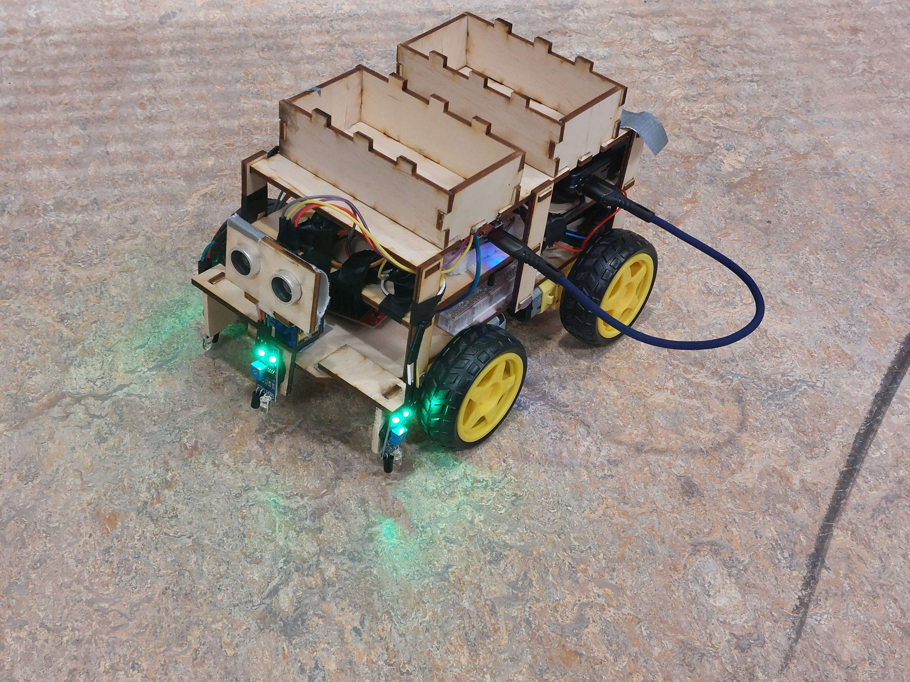
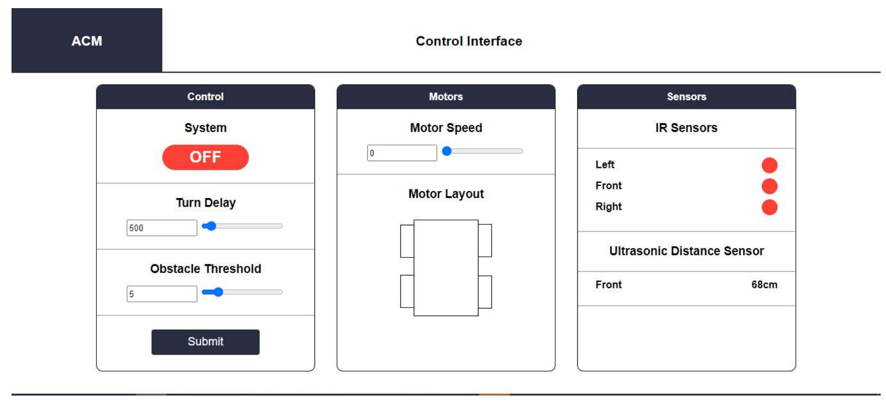

# 🚚 Automatic Container Mover (ACM)

De **Automatic Container Mover** is een autonome rover die slim een pad kan navigeren, obstakels detecteert en op afstand bestuurd kan worden via een real-time dashboard.  
Het project combineert embedded C++, sensorfusie, route-planning-algoritmes en een moderne webinterface voor monitoring en controle.

---

## ✨ Features

- **Autonome navigatie** op basis van meerdere sensoren:
  - Infraroodsensoren
  - Ultrasoon sensoren
  - Reed-switch sensoren
- **Real-time dashboard** (browser) om:
  - De rover te starten/stoppen
  - Sensorstatus live te volgen
  - Telemetrie te bekijken
- **Slimme route-algoritmes** voor optimale padbepaling  
  (meerdere algoritmen getest en vergeleken)
- **Veilige communicatie** tussen rover en dashboard
- **Modulair ontwerp** voor eenvoudige uitbreidbaarheid

---

## 🧠 Technologieën

### Embedded (Rover)
- **C++**
- Microcontroller (Arduino/ESP/STM32)
- Sensorcommunicatie (IR, ultrasonisch, reed)
- Motor control (PWM, H-bridge)

### Dashboard & Backend
- **JavaScript**
- WebSockets / HTTP
- Real-time UI (HTML/JS)

---

## 📸 Foto’s

