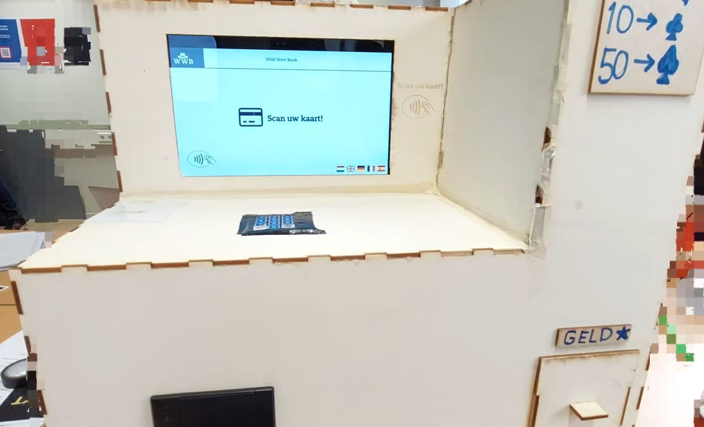
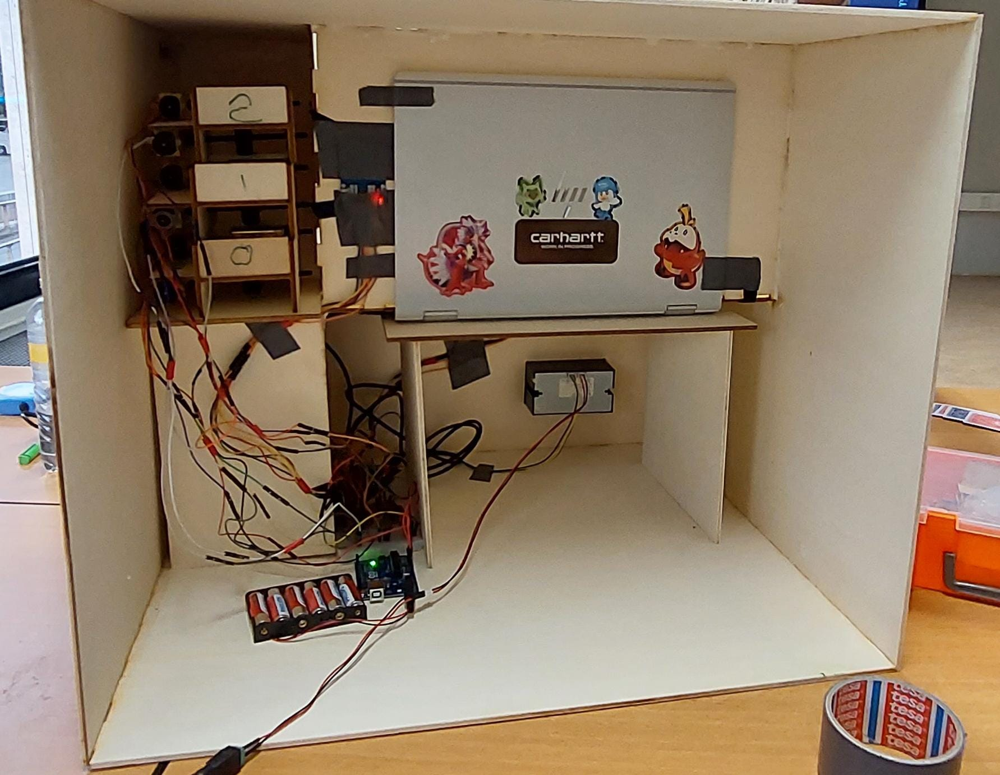

# ATM Project

A modern, full-stack Automated Teller Machine (ATM) system built as a multi-component engineering project. This system simulates a real ATM with **cash dispensing**, **receipt printing**, **bank API integration**, **secure authentication**, and a **real-time web dashboard**. The project combines embedded programming, backend development, database engineering, and automated testing.

---

## 🚀 Overview

This ATM system was designed to replicate the behavior of a real banking terminal while experimenting with distributed systems and embedded hardware. It integrates:

- A **C++ embedded controller** that manages hardware components such as motors, sensors, and the receipt printer.
- A **Node.js + Express backend** responsible for handling transactions, validating accounts, and connecting to external “bank” APIs.
- A **MySQL database** hosted on a remote Linux server for storing account and transaction data.
- A **real-time web interface** built with JavaScript and WebSockets for monitoring the machine and interacting with API endpoints.
- **Python-based unit tests** for validating API behavior and edge cases.

This project emphasizes reliability, security, and modularity in a simulated financial environment.

---

## 📸 Photos

> Here are some pictures of the hardware setup:

---

## 🧠 Features

### 💳 Core ATM Features
- Withdraw cash with realistic denomination handling
- Print receipts with transaction info
- Handle invalid PINs, insufficient funds, and blocked accounts
- Support for external bank integration through mock APIs

### 🔄 Backend
- Node.js (Express) REST API
- Real-time communication using WebSockets
- Secure verification and request validation
- Logging of all transactions

### 🗄 Database (MySQL)
- Account table with balance, pin, and metadata
- Transaction logging for audit trails
- Hosted on a Linux server (remote)

### 🔌 Embedded System
- C++ controller for:
  - Motorized cash dispensing
  - Thermal printing
  - Sensor feedback
- Communicates with backend via serial/USB

---

## 🛠️ Tech Stack

| Component | Technology |
|----------|------------|
| Embedded Controller | C++ |
| Backend API | Node.js, Express |
| Database | MySQL |
| Real-time Dashboard | JavaScript, WebSockets |
| Testing | Python (unittest) |

---

## 🎯 Goals of the Project
- Explore the integration between embedded systems and cloud services
- Build a realistic distributed banking simulation
- Practice secure API design
- Gain experience with hardware-software interaction