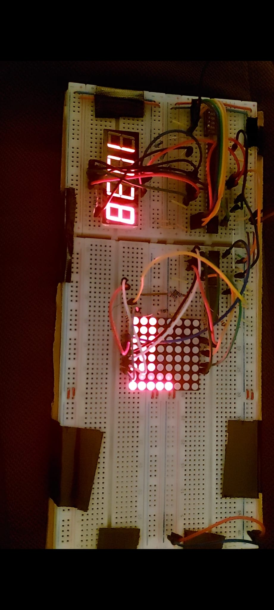

# 🌡️ Digitale Thermometer

De **Digitale Thermometer** is een low-level embedded project gebouwd rond de **ATtiny85** microcontroller.  
De thermometer leest temperatuurdata uit, stuurt meerdere displays aan via **SPI** en toont zowel de actuele temperatuur als de temperatuur over tijd.

Het project is opgezet met de focus op efficiënt geheugenbeheer, real-time dataverwerking en minimalistische embedded C-ontwikkeling op zeer beperkte hardware.

---

## ✨ Features

- **Realtime temperatuurmeting**
- Aansturen van:
  - **7-segment display** (actuele temperatuur)
  - **Matrix display** (temperatuur als functie van tijd)
- **SPI-seriële communicatie** voor alle externe modules
- Geoptimaliseerd C-programma voor beperkte microcontroller-resources
- Robuuste en efficiënte low-level implementatie

---

## 🧠 Technologieën

### Embedded & Firmware
- **C**
- **C++**
- ATtiny85 microcontroller
- SPI-communicatie
- Shift register

### Hardware
- 7-segment display
- LED-matrix
- Temperatuursensor (BME280)

---

## 📸 Foto’s & Schema’s

