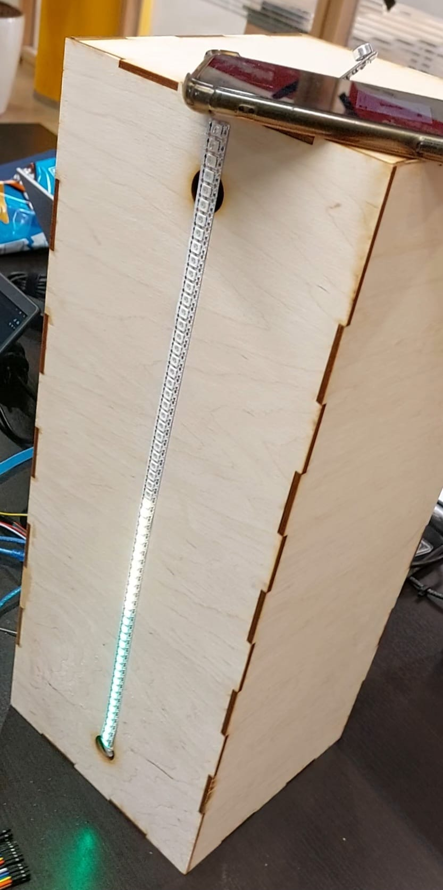

# 🔊 Sound Intensity Visualizer

De **Sound Intensity Visualizer** is een embedded C++ project dat omgevingsgeluid analyseert en de intensiteit daarvan visualiseert met behulp van een LED strip. 
Het systeem leest analoge microfooninput uit, verwerkt de waardes in real-time en zet deze om in een visuele representatie van het geluidsniveau.

Dit project combineert low-level microcontrollerprogrammering, signaalverwerking en hardwarematige LED-visualisatie.

---

## ✨ Features

- 📡 **Real-time geluidsintensiteit meting**
- 🔄 **Analoge sampling** van microfoonsignalen (ADC)
- 💡 **LED visualisatie**:
 LED-strip visualisatie
- ⚙️ **Dynamische schaalverwerking**
- ⚡ Sensor calibratie

---

## 📸 Foto

