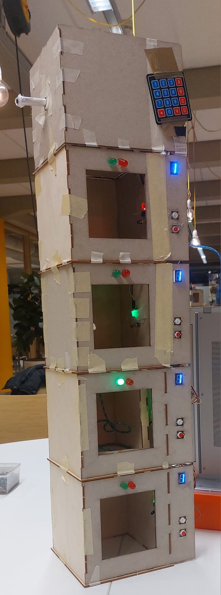
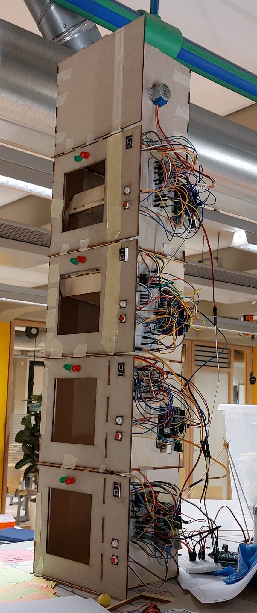

# 🛗 Lift Project

Het **Lift Project** is een embedded groepsproject waarin een volledig werkende liftinstallatie is gebouwd met behulp van meerdere microcontrollers.  
Elke student ontwikkelde zijn **eigen verdieping**, die via **I²C** communiceert met de rest van het systeem. De lift wordt aangedreven door een motor, bestuurd vanuit een centrale controller die coördinatie en veiligheid waarborgt.

Het project combineert embedded C++, sensorinterfacing, motorbesturing en gedistribueerde systeemlogica.

---

## ✨ Features

- 🧩 **Gedecentraliseerde architectuur**  
  Elke verdieping heeft een eigen microcontroller met eigen logica.

- 🔗 **I²C-communicatie**  
  Alle verdiepingen en de hoofdliftcontroller zijn verbonden via een I²C-bus.

- ⚙️ **Motorbesturing**  
  Liftmotor aangestuurd via PWM of H-bridge driver.

- 🚦 **Knoppen & indicatie-LEDs**  
  Elke verdieping bevat knoppen voor het oproepen van de lift en status-indicatoren.

- 🛡️ **Veiligheidscontroles**  
  Positiebewaking en eenvoudige failsafes geïntegreerd.

---

## 🧠 Technologieën

### Embedded
- **C++**
- Microcontrollers (Arduino/ATmega/soortgelijk)
- I²C-buscommunicatie
- Motor drivers
- Interrupts voor knoppen en sensors

### Hardware
- Microcontrollers voor elke verdieping
- Centrale controller voor de lift
- I²C bekabeling
- Motor + driver
- Knoppen, LEDs, sensoren

---

## 📸 Foto’s

> Voeg hier foto's toe van de liftopstelling, de verschillende verdiepingsmodules en schema’s.

