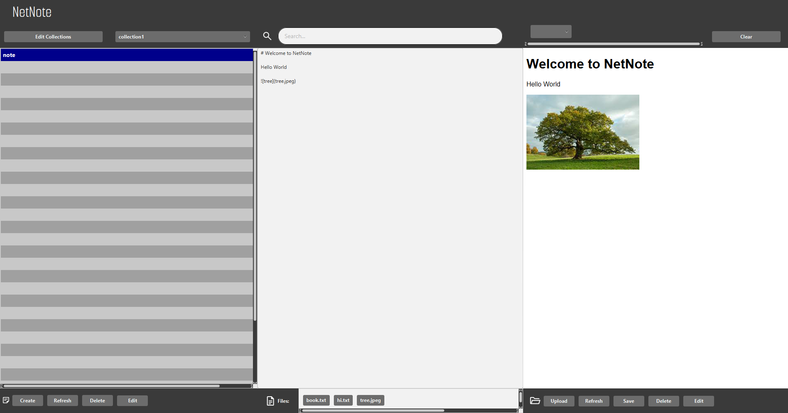

# CSEP - group 49 
# NetNote

This repository contains the **CSE project**. 

To run the project from the command line, you either need to have [Maven](https://maven.apache.org/install.html) installed on your local system (`mvn`) or you need to use the Maven wrapper (`mvnw`). You can then execute

	mvn clean install

to package and install the artifacts for the three subprojects. Afterwards, you can run ...

	cd server
	mvn spring-boot:run

to start the server or ...

	cd client
	mvn javafx:run

to run the client. Please note that the server needs to be running, before you can start the client.

---
## Meaningful addition

- A meaningful addition has been added to the project.
- The addition is regarding the files that get uploaded to the server.
- Instead of storing just the filename in the database, additional meta-data has been added including the following:
  - Content-type
  - Filesize
  - Added date
- For more information refer to [Files](#files) in the default scene section.

## Getting started
- Before starting the application, you have the option to add custom styles to the WebView, by editing the `client/config.css`.
 - The project will open in the default scene, where notes can be edited 
and are automatically rendered with Markdown in the webview.
 - Notes can only be created within collections, so to start writing a note you 
must first head over to the collection window, by pressing a button
in the top left. (Ctrl/Cmd + Shift + N)
 - There, you can create a new collection by writing a 
title in the textbox and pressing "add" (Enter). Click "done" to return to the
default scene. (Ctrl/Cmd + K)
 - Select your collection from the drop-down selector (Ctrl/Cmd + M) in 
the top left and click "Create" (Ctrl/Cmd + N) to create a new note. Give it a name 
and hit create or Enter. 
 - Now you can select it  in the sidebar (Ctrl/Cmd + '=')
and start editing it.

---
## The default scene
### Notes
 - In the default scene, the note that is currently being edited is updated 
once every 5 seconds, so be aware of that 
 - All notes from all collections
can be viewed by clicking "All notes" in the collection selector. 
 - You can also search for notes (both by title and by content) by typing in
the searchbar and pressing on what results come up.
 - Notes can be added by selecting a collection and pressing the "create" button
 - Notes can be deleted by selecting a note and pressing the "delete" button.
 - Notes can be edited, allowing the user to change their title or the 
collection in which they are stored. This is done by pressing "Edit"
### Tags & Links
 - **Within collections**, notes can be further organised using tags and links
 - Notes can contain tags by using the syntax \#tag. Then, the user is 
able to filter by tags by choosing tags in the top-right, or by clicking on the rendered
buttons that appear in the webview. 
 - Tags can be cleared by clicking the "clear" button in the top right
 - Notes can also contain links to other notes by using the syntax \[\[linked_note]]. 
By clicking the link, the users can access those notes.
### Files
- On the server uploaded files are represented in two ways:
  - As an entity on the database. This entity contains all the meta-data, but not the file content.
  - A copy of the file on filesystem, that can be found `/server/uploads`
    - Collections and notes are also represented in the filesystem as directories. 
    - So a `collection` directory, containing a `note` directory, containing the files.
- The files belonging to a note can be seen in the file bar at the bottom by selecting the note.
- In the bottom right are all the buttons used to perform operation on a file, like deleting, uploading and editing.
- An operation on a file can be done, by first selecting the file (i.e. clicking on it), and then clicking the corresponding button.
- It is possible to embed images into a note.
  - First upload the image by clicking the upload button and then selecting the image in the filesystem.
  - Then in your note you can use the following syntax: `{width;height}`
    - `filename` represents the name of the image
    - `width` The width of the image in pixels (There is no need to add `px` at the end).
    - `height` The height of the image in pixels.
- The server stores some meta-data about the file. 
- This meta-data can be seen by placing the cursor on the file at the bottom and waiting a few seconds.
- A file belongs to a note. So when a note is deleted, both the file entities and the copies on the filesystem will be deleted.

---
## The collection scene
### Collections
 - Users can add collections by writing in the textbox and clicking "create".
 - Users can edit a collection by selecting it and clicking "edit".
 - Users can delete a collection by selecting it and clicking "delete".
### Live language switch
 - Users can select the language by choosing one from the menu.

---
## Keyboard Shortcuts
The following keyboard shortcuts have been implemented:
- In default scene:
    - escape: sets the input focus to searchbar
    - enter: sets focus on text field
    - ctrl/cmd + N: same as button "Create"
    - ctrl/cmd + Shift + N: same as button "Edit collections"
    - ctrl/cmd + E: same as button "Edit"
    - ctrl/cmd + D: same as button "Delete"
    - ctrl/cmd + R: same as button "Refresh"
    - ctrl/cmd + M: opens collection menu
        - when collection menu is opened, arrows down and up allow navigating through collections
    - ctrl/cmd + =: moves to next note
    - ctrl/cmd + -: moves to previous note
- In all other scenes:
    - ctrl/cmd + K: goes back to default scene
    - escape: sets focus to text field
    - enter: same as button "Confirm/Done"

---
## Automatic change synchronisation 
With 2 or more clients open at the same time, some functionality is automatically synced using **WebSockets**:
- Editing the content of the note (both clients **must** have the same note opened)
- Adding a new note
- Deleting an existing note
- Changing the title of a note

## Demo

